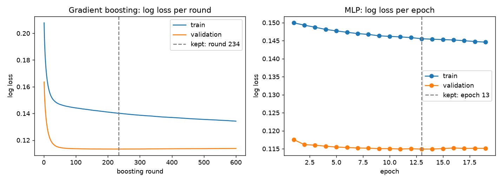
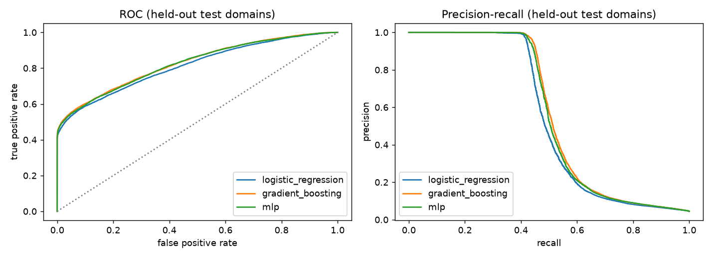
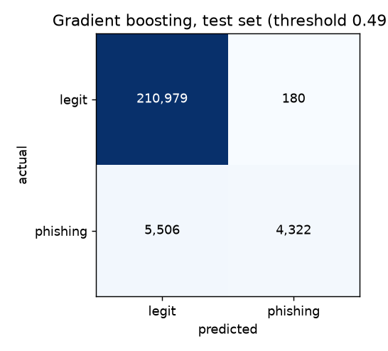

# Phishing URL Detection


Scores how likely a URL is to be phishing, from its domain alone, before anyone clicks it.
The model is trained on **real data**: 235,795 labelled URLs from the PhiUSIIL dataset plus
574,039 real popular domains from the Tranco top-1M list. It is then tested on **phishing
sites that were live on the day of training** (the OpenPhish feed) and on 191,347 held-out
real domains.

**Live demo:** https://phishvpn-detection-ochre.vercel.app (score any URL; nothing is fetched or visited)
**API docs:** https://phishvpn-detection-ochre.vercel.app/docs

## Results at a glance

Shipped model: gradient boosting, decision threshold 0.4953, chosen on validation data so
that only 1 in 1,000 legitimate domains gets flagged.

| What was measured | Data | Result |
|---|---|---|
| Live phishing domains caught | OpenPhish feed, 253 unique domains, fetched 2026-10-04 04:29 UTC | **63.2%** (160 of 253) |
| False alarms on real sites | 191,347 held-out Tranco domains | **0.09%** (9 per 10,000) |
| Accuracy | 220,987 held-out domains (PhiUSIIL test + Tranco test) | 97.43% |
| Precision / recall | same | 96.00% / 43.98% |
| F1 | same | 0.6032 |
| ROC-AUC / PR-AUC | same | 0.8275 / 0.5630 |
| Log loss / Brier score | same | 0.1129 / 0.0245 |

The precision and recall above are on 220,987 held-out domains, of which 9,828 are
phishing. **What this means in production**, combining live recall with the false-alarm
rate on real sites:

| If phishing is ... of visited sites | Share of warnings that are real phishing |
|---|---|
| 1% | 87.65% |
| 0.1% | 41.29% |

At this operating point, 63 of every 100 live phishing domains get a warning, while
9 of every 10,000 legitimate sites get a false one.

## Why only the domain? (dataset shortcut audit)

PhiUSIIL is widely used, and it has a shortcut big enough to make almost any model look
perfect. `python -m phishurl.audit` measures it on the full 235,795 rows:

| Check | Result |
|---|---|
| Legitimate URLs that start with `https://www.` | 100% |
| Phishing URLs that start with `https://www.` | 2.43% |
| Legitimate URLs with any path after the domain | 0% |
| Accuracy of the one-line rule "not `https://www.` → phishing" | **98.96%** |
| Best single precomputed feature (`URLSimilarityIndex`) ROC-AUC | 0.9961 |
| Gradient boosting on all 50 numeric dataset features: test accuracy | **100%** |

A 100% score here measures URL *formatting*, not phishing. So this project throws away the
scheme, `www.`, subdomains, path and query string, and computes its own 16 features from
the **registrable domain** only (for example `paypal-verify.com`, or
`caseid42.firebaseapp.com` on a shared hosting platform). The test
`test_path_scheme_and_www_do_not_change_features` enforces this.

Features: domain name length, digit count and ratio, hyphens, character entropy, vowel
ratio, longest consonant and digit runs, brand words (`paypal`, `microsoft`, ...), lure
words (`login`, `verify`, ...), suffix depth, shared-hosting suffix (from the Public
Suffix List private section, e.g. `*.pages.dev`), raw IP, punycode, and the top-level domain.

## Data

| Dataset | What it is | Used for | License |
|---|---|---|---|
| [PhiUSIIL Phishing URL Dataset](https://archive.ics.uci.edu/dataset/967/phiusiil+phishing+url+dataset) (UCI #967) | 235,795 URLs: 100,945 phishing, 134,850 legitimate | training / validation / test | CC BY 4.0 |
| [Tranco top-1M](https://tranco-list.eu/), list [`Y83KG`](https://tranco-list.eu/list/Y83KG/1000000) | 1,000,000 most popular registrable domains (30 days to 2026-10-03) | extra legitimate examples, false-alarm test | see Tranco site |
| [OpenPhish community feed](https://openphish.com/feed.txt) | phishing URLs live on 2026-10-04 | **evaluation only**, never trained on | non-commercial research only; not redistributed |

Preparation (`src/phishurl/data.py`):

- PhiUSIIL URLs are reduced to registrable domains. Domains that appear with both labels
  are dropped (106), and duplicates are collapsed. That leaves **197,602 unique domains**
  (65,522 phishing, 132,080 legitimate).
- These are split 70/15/15 **by domain**, so no domain is ever in both training and test:
  138,322 train, 29,640 validation, 29,640 test.
- Tranco domains already present in PhiUSIIL are removed (43,267). The remaining 956,733
  are split 60/20/20: 574,039 train, 191,347 validation, 191,347 test.
- 8 of the 253 live OpenPhish domains also occur in PhiUSIIL's training set.

`scripts/download_data.py` fetches all three sources. Raw data is never committed:
`data/` is gitignored, and the OpenPhish feed contains live malicious URLs.

| File | SHA-256 |
|---|---|
| `phiusiil.zip` (UCI) | `0a639fd03aea6308c5b1c10c92aa23c2ce1505447a9137271865cd0badc9a59a` |
| `tranco-top-1m.csv.zip` (list Y83KG) | `11d604d8cdf9418eb85a28337deec72466dadd38be740b4c69910cf982e1c0c3` |
| `openphish-feed.txt` (2026-10-04 04:29 UTC) | `15ce676d5e2b2ad96cc040b0ea00b6cfb47ffd90f80571f5b23ff9601b511a41` |

## Training

Three models are trained on the same 712,361 domains (6.4% phishing), with early
stopping on the 220,987-domain validation set (4.4% phishing):

| Model | Training | Stopped at | Train / validation log loss |
|---|---|---|---|
| Logistic regression | L-BFGS | 161 solver iterations | 0.1526 / 0.1176 |
| **Gradient boosting** (shipped) | 600 rounds recorded | best round **234** | 0.1402 / 0.1134 |
| MLP (64-32 hidden units) | mini-batch Adam, 512 per batch | best epoch **13** of 19 (patience 6) | 0.1455 / 0.1149, val accuracy 97.35% |

Training loss is higher than validation loss because the training set has more phishing
(6.4% vs 4.4%), not because of a bug. The gaps between train and test metrics are small;
see `reports/metrics.json`.



### Model comparison (held-out test, threshold for 0.1% false positives)

| Model | Accuracy | Precision | Recall | F1 | ROC-AUC | PR-AUC | Log loss | Live OpenPhish recall | Tranco false alarms |
|---|---|---|---|---|---|---|---|---|---|
| Logistic regression | 97.32% | 94.95% | 42.06% | 0.5830 | 0.8128 | 0.5394 | 0.1171 | 62.85% | 0.11% |
| **Gradient boosting** | **97.43%** | **96.00%** | **43.98%** | **0.6032** | **0.8275** | **0.5630** | **0.1129** | **63.24%** | **0.09%** |
| MLP | 97.38% | 95.59% | 42.99% | 0.5931 | 0.8255 | 0.5565 | 0.1140 | 62.85% | 0.10% |




Confusion matrix of the shipped model on the 220,987 test domains: 210,979 true negatives,
180 false positives, 5,506 false negatives, 4,322 true positives.

### Looser operating point (1 false alarm per 100 sites)

Gradient boosting at threshold 0.1754: live OpenPhish recall 67.98%, Tranco false alarms
1.06%, test precision 69.26%, test recall 48.17%. That's about 4.8 more live phishing
domains caught per 100, at about 12 times the false alarms. That trade is not worth it
for a browser warning, so it isn't shipped.

### Why Tranco is in the training data (ablation)

The same gradient boosting model trained on PhiUSIIL alone looks better on PhiUSIIL's own
test set (ROC-AUC 0.8640). On real popular sites, though, it falls apart: at its 1%
validation threshold it flags **12.09%** of held-out Tranco domains, and 2.31% even at its
0.1% threshold. PhiUSIIL's legitimate domains are a narrow sample. Adding real Tranco
domains to training changes this:

| Operating point | False alarms on Tranco (PhiUSIIL only → with Tranco) | Live OpenPhish recall (PhiUSIIL only → with Tranco) |
|---|---|---|
| 1% validation FPR | 12.09% → 1.06% (11× fewer) | 75.49% → 67.98% |
| 0.1% validation FPR | 2.31% → 0.09% (26× fewer) | 66.01% → 63.24% |

## Limitations

- **Domain only.** A phishing page hosted on a hacked legitimate domain gets that domain's
  score. 36.8% of the live OpenPhish domains were missed at the shipped threshold, and
  PhiUSIIL test recall is 43.98%. This is a first-line filter, not a complete defence.
- **Shared hosting.** Subdomains of platforms like `*.pages.dev` or `*.firebaseapp.com`
  are scored as their own domain, and the platform feature raises their risk. Honest
  personal sites on those platforms can be flagged.
- **Tranco is popularity, not a guarantee of being benign.** A few Tranco domains may be
  malicious, which makes the false-alarm rate slightly pessimistic.
- **The live test is one snapshot** of 253 domains. Rerun `scripts/download_data.py` and
  `python -m phishurl.train` to measure on today's feed.
- **Reasons are descriptive.** The demo lists features outside the 5th-95th percentile
  range of legitimate training domains. They describe the domain; they are not exact
  model attributions.

## Run it

```bash
pip install -r requirements-dev.txt
python scripts/download_data.py                        # ~25 MB into data/
PYTHONPATH=src python -m phishurl.train                # about 9 minutes on a laptop CPU
PYTHONPATH=src python -m phishurl.audit                # dataset shortcut audit
PYTHONPATH=src python -m uvicorn phishurl.api.app:app --reload --port 8000
```

`train` writes `src/phishurl/artifacts/model.joblib` and `model_card.json` (loaded by the
API) and `reports/metrics.json` plus `reports/figures/`. The numbers in this README come
from that file (run time 548 s on a Ryzen 7 7445HS).

```bash
curl -X POST http://localhost:8000/v1/score -H "Content-Type: application/json" \
     -d '{"url": "https://secure-account-verify-paypa1.com/login"}'
```

`GET /v1/stats` returns the deployed model's test, live and business metrics.

## Tests

```bash
pytest --cov=src
```

31 tests cover feature extraction (including the "path never changes the score"
guarantee), dataset loading, the domain-disjoint split, metric and threshold maths, all
three trainers, explanations and the API. Line coverage is 64%; the offline training,
plotting and audit scripts are exercised by running `train`, not by unit tests. CI runs
lint and tests on Python 3.11 to 3.13.

## Project layout

```
src/phishurl/
  features.py   URL -> registrable domain -> 16 features
  data.py       PhiUSIIL / Tranco / OpenPhish loaders, dedupe, domain-disjoint splits
  models.py     logistic regression, gradient boosting (per-round loss), MLP (per-epoch loss)
  metrics.py    accuracy, precision, recall, F1, ROC/PR-AUC, log loss, Brier, business metrics
  audit.py      PhiUSIIL shortcut audit
  train.py      end-to-end training + evaluation -> artifacts/ and reports/
  scorer.py     loads the shipped model for the API
  explain.py    plain-language reasons
  api/app.py    FastAPI service + demo page
scripts/download_data.py
reports/        metrics.json and figures from the last training run
```

## References

- A. Prasad and S. Chandra, "PhiUSIIL: A diverse security profile empowered phishing URL detection
  framework based on similarity index and incremental learning", *Computers & Security* 136 (2024).
  doi:10.1016/j.cose.2023.103545
- V. Le Pochat et al., "Tranco: A Research-Oriented Top Sites Ranking Hardened Against
  Manipulation", NDSS 2019.
- OpenPhish community feed, https://openphish.com (used under its non-commercial research terms).

## License

MIT for the code. The datasets keep their own licenses (see the Data section).
